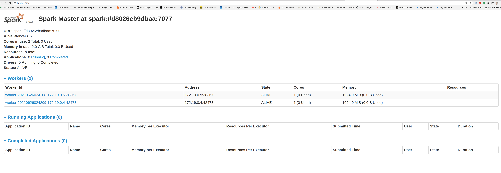
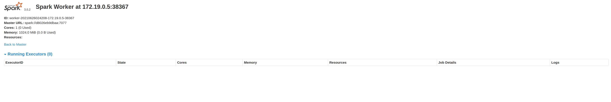
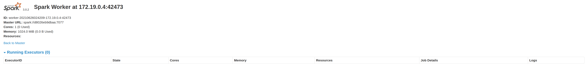

# Spark Irrigation with Docker & docker-compose(2021 ver.)

# General

A simple spark standalone cluster for your testing environment purposes. A *docker-compose up* away from you solution for your spark development environment.

The Docker compose will create the following containers:

container|Exposed ports
---|---
spark-master|9090 7077
spark-worker-1|9091
spark-worker-2|9092

# Installation

The following steps will make you run your spark cluster's containers.

## Pre requisites

* Docker installed

* Docker compose  installed

## Build the image


```sh
docker build -t spark:3.1.2 .
```

## Run the docker-compose

The final step to create your test cluster will be to run the compose file:

```sh
docker-compose up -d
```

## Validate your cluster

Just validate your cluster accesing the spark UI on each worker & master URL.

### Spark Master

http://localhost:9090/



### Spark Worker 1

http://localhost:9091/



### Spark Worker 2

http://localhost:9092/




# Resource Allocation 

This cluster is shipped with three workers and one spark master, each of these has a particular set of resource allocation(basically RAM & cpu cores allocation).

* The default CPU cores allocation for each spark worker is 1 core.

* The default RAM for each spark-worker is 1024 MB.

* The default RAM allocation for spark executors is 256mb.

* The default RAM allocation for spark driver is 128mb

* If you wish to modify this allocations just edit the env/spark-worker.sh file.

# Binded Volumes

To make app running easier I've shipped two volume mounts described in the following chart:

Host Mount|Container Mount|Purposse
---|---|---
apps|/opt/spark-apps|Used to make available your app's jars on all workers & master

This is basically a dummy DFS created from docker Volumes...(maybe not...)

## How to attach you container ?

Example: if you container id is c0, let try the following command
```sh
docker exec -it c0 /bin/bash
```

## Inside container, let try with spark-shell
```sh
./bin/spark-shell --master spark://spark-master:7077
```
## Inside container, let try with pyspark
```sh
./bin/pyspark --master spark://spark-master:7077
```

## Run some example
```sh
./bin/run-example --master spark://spark-master:7077 SparkPi 1000
```

```sh
./bin/spark-submit --master spark://spark-master:7077 examples/src/main/python/pi.py 1000
```

```sh
./bin/spark-submit --master spark://spark-master:7077 --class SimpleApp /opt/spark-apps/fuzzy/fuzzylogic/target/scala-2.12/fuzzylogic_2.12-0.1.0-SNAPSHOT.jar
```

```sh
./bin/spark-submit --master spark://spark-master:7077 --class simpleFuzzy /opt/spark-apps/fuzzy2/fuzzylogic/target/scala-2.12/fuzzylogic_v2_2.12-0.1.0-SNAPSHOT.jar
```